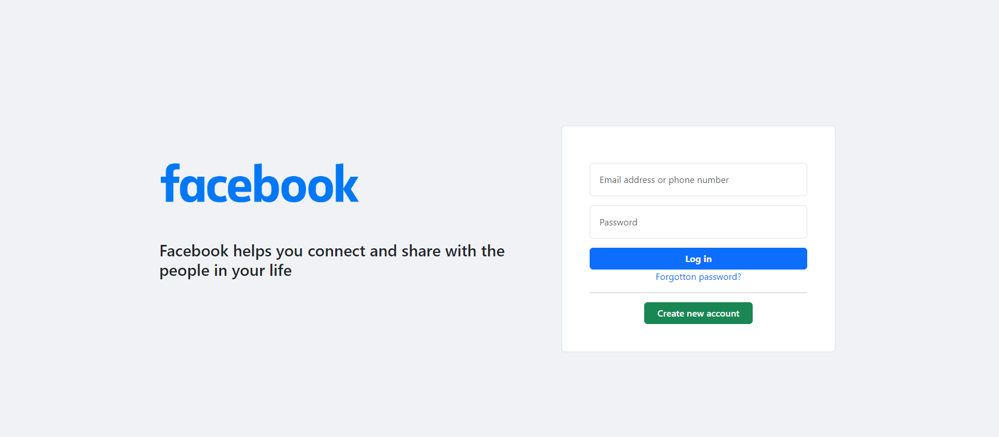
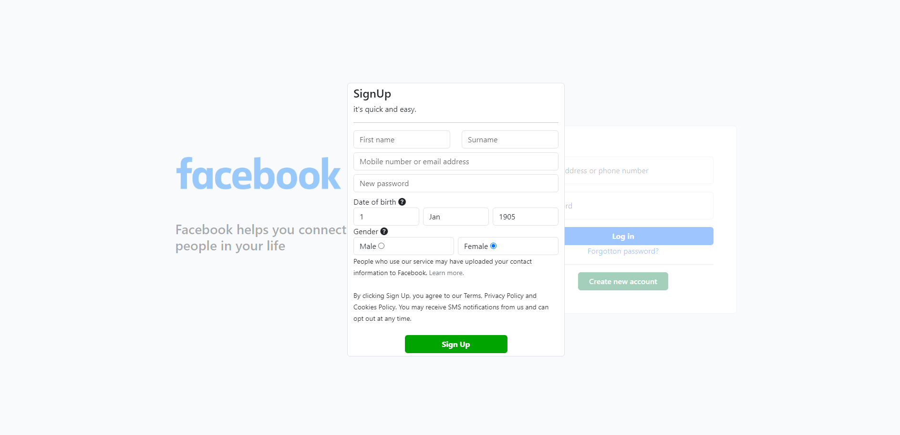

# Facebook Sign-in/Sign-up Page

This project is a web application that includes Facebook Sign-in and Sign-up functionalities. Users can log in or create an account using their Facebook credentials.




## Table of Contents
- [Features](#features)
- [Getting Started](#getting-started)
  - [Prerequisites](#prerequisites)
  - [Installation](#installation)
- [Usage](#usage)
- [Contributing](#contributing)
- [License](#license)
- [Acknowledgments](#acknowledgments)

## Features

- **Facebook Sign-in:** Users can log in using their Facebook credentials.
- **Facebook Sign-up:** New users can create an account using Facebook.

## Getting Started

Follow these instructions to set up the project on your local machine.

### Prerequisites

- Web browser (Google Chrome, Firefox, etc.)
- [Facebook App](https://developers.facebook.com/apps) for API credentials.

### Installation

1. Clone the repository.

```bash
git clone https://github.com/rohail-m/facebook
cd facebook-signin-signup
